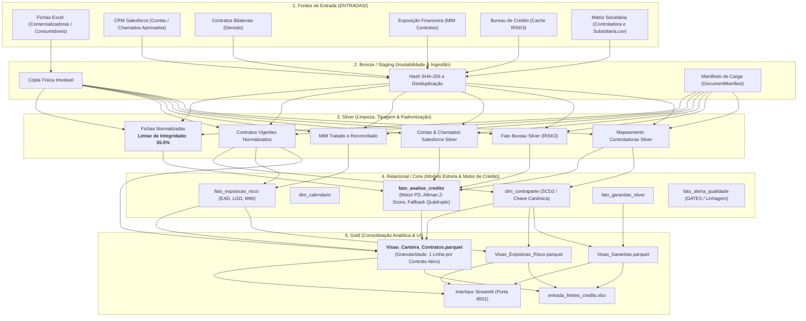
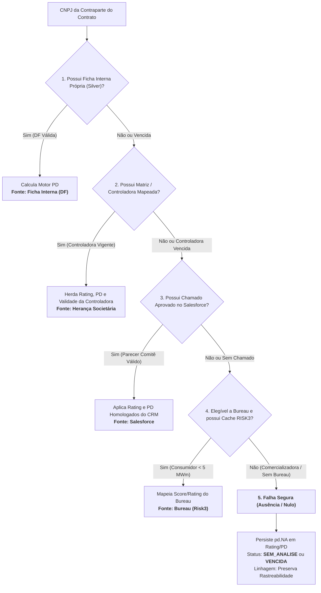

# Documentação Arquitetural e Funcional As-Is — Sistema BD Crédito (BDC)

---

**Sistema:** BD Crédito (BDC) — Plataforma Unificada de Gestão de Dados de Risco de Crédito  
**Versão Atual:** 1.2.6 (Operacional As-Is)  
**Data da Documentação:** 30/09/2026  
**Área Proprietária:** Gestão de Risco de Mercado e Crédito (Copel Mercado Livre)  
**Fontes Normativas de Referência:**
* *Planejamento do Sistema de Gestão de Dados de Crédito — BD Crédito* (v1.2, 21/07/2026)
* *Nota Técnica — Probabilidade de Default (PD) e Taxa de Risco de Crédito (TRC)* (v7, 10/09/2026 / NT 1.2 e NCE 4.03)
* *Norma de Limites de Crédito e Exposição a Mercado* (NCE 4.03)

---

## 1. Visão Geral e Arquitetura de Dados (Medallion)

### 1.1 Objetivo Central do Sistema
O **BD Crédito (BDC)** é a plataforma corporativa responsável por centralizar, padronizar e governar todas as dimensões de **Risco de Crédito**, **Contratos de Energia Bilaterais** e **Exposição Financeira (Mark-to-Market — MtM)** da Copel Mercado Livre. 

Antes do BDC, os dados de crédito encontravam-se fragmentados entre planilhas Excel heterogêneas de demonstrações financeiras (DFs), relatórios manuais de birô externo, registros desnormalizados no CRM Salesforce e bases contratuais do Denodo. O objetivo primordial do BDC é consolidar essa massa de dados em uma **Visão Única da Contraparte e do Contrato**, fornecendo ao Comitê de Risco, à Mesa de Operações e aos sistemas de auditoria números fidedignos, rastreáveis e em conformidade estrita com a **NT 1.2** e **NCE 4.03**.

---

### 1.2 Topologia de Dados Medallion

A arquitetura do BDC foi construída sob o padrão **Medallion**, garantindo a imutabilidade das fontes originais, a rastreabilidade total de transformações (linhagem de dados) e a separação estrita de responsabilidades entre as camadas:



---

### 1.3 Descrição Técnica das Camadas

#### A. Entradas / Fontes Primárias (`ENTRADAS/`)
* **Fichas Cadastrais de Crédito (Excel):** Planilhas com demonstrações contábeis (BP, DRE, DFC) de agentes comercializadores e consumidores livres/especiais.
* **CRM Salesforce:** Extrações analíticas de `Account` (cadastro, grupo econômico) e `Chamado` (avaliações aprovadas pelo comitê de crédito).
* **Contratos Bilaterais (Denodo):** Base relacional operacional de contratos de compra e venda de energia, identificadores de contraparte, volumes (MWh/MWm), vigência e preços.
* **Marcação a Mercado (MtM):** Base quantitativa diária contendo a exposição financeira presente (`MTM_TOTAL`) e a valor presente líquido (`MTM_VPL`).
* **Bureau de Crédito (RISK3):** Base em cache JSON com consultas de score comportamental, restritivos e apontamentos cadastrais.
* **Matriz Societária:** Arquivo declarativo `Controladora e Subsidiaria.csv` contendo as relações de grupo econômico, matrizes, filiais e SPEs geradoras.

#### B. Staging / Bronze
* **Responsabilidade:** Ingestão de baixo nível e preservação física dos arquivos brutos.
* **Regra Arquitetural:** Arquivos em Bronze são **imutáveis**. A ingestão calcula o hash criptográfico SHA-256 de cada documento para impedir reprocessamento redundante (idempotência). O catálogo gera um `DocumentManifest` contendo data, origem, usuário e metadados de auditoria. É expressamente proibido calcular regras de negócio ou métricas de risco nesta camada.

#### C. Silver
* **Responsabilidade:** Limpeza estrutural, tipagem estrita, cast de tipos, normalização de CNPJs (remoção de caracteres não numéricos e padding para 14 dígitos), unificação de datas (formato ISO `YYYY-MM-DD`) e padronização de nomenclatura de domínios.
* **Mecanismo de Confiança e Limiar Dinâmico (35%):**
  * As fichas contábeis no mercado livre de energia sofrem com alta volatilidade de layouts (mais de 10 variações históricas de abas e nomenclaturas de contas).
  * O motor de extração (`extrator.py`) aplica um torneio de layouts por força bruta ponderada.
  * O limiar mínimo de integridade foi fixado estruturalmente em **35.0%** no `config.json` (validado pelo `schema_config.json` via `quality_loader.py`). Esse limiar garante que fichas contábeis com 100% dos dados financeiros preenchidos (Ativo, Passivo, DRE, FCO, PL) sejam aprovadas na Silver, descartando apenas arquivos sem dados financeiros essenciais ou corrompidos.
* **Regra de Ouro da Silver:** A camada Silver reflete estritamente a **verdade da origem**. É terminantemente proibido calcular Score, Rating, PD ou Taxa de Risco nesta camada.

#### D. Relacional / Core (Modelo Estrela)
* **Responsabilidade:** Camada de inteligência analítica onde reside o motor de crédito e a modelagem dimensional histórica.
* **Tabelas Principais:**
  * `dim_contraparte.parquet`: Dimensão conformada de contrapartes, aplicando versionamento histórico **SCD2** (`_VERSAO_REGISTRO`, `_STATUS_REGISTRO`, `_DATA_INICIO`, `_DATA_FIM`).
  * `fato_analise_credito.parquet`: Tabela fato que armazena a avaliação de risco consolidada, o histórico temporal de ratings, as probabilidades de default e a linhagem de cálculo.
  * `fato_exposicao_risco.parquet`: Consolidação da exposição financeira líquida, EAD (Exposure at Default) e parâmetros de perda esperada (LGD).
  * `fato_alerta_qualidade.parquet`: Trilha de auditoria operacional que registra rejeições, falhas de GATES e avisos de qualidade.

#### E. Gold (Consolidação de Negócio)
* **Responsabilidade:** Visões finais desnormalizadas, de altíssima performance, formatadas especificamente para consumo da Diretoria, da interface web Streamlit e de ferramentas corporativas de BI.
* **Artefato Principal:** `Visao_Carteira_Contratos.parquet` (detalhado na Seção 3).

---

## 2. Regras de Negócio e Transformações de Crédito

### 2.1 Regra de Enquadramento Metodológico (Threshold de Volume)

Em estrita consonância com a **Seção 7.2 do Planejamento Funcional** e a **Nota Técnica v7**, o BDC segrega as contrapartes consumidoras com base em sua materialidade e exposição de consumo físico:

| Segmento Metodológico | Critério de Enquadramento | Metodologia de Risco Exigida | Fonte de Risco Primária |
| :--- | :--- | :--- | :--- |
| **Comercializadoras Puras / Grupo** | Todas as comercializadoras de energia | Análise Contábil Completa (DF) | Balanço Patrimonial + DRE + DFC |
| **Geradoras / SPEs** | Agentes geradores e produtores independentes | Análise Contábil Completa (DF) / Herança | Balanço do Projeto ou Patrocinador |
| **Consumidores $\ge \mathbf{5\text{ MWm}}$** | Consumo médio contratado $\ge 5\text{ MWm}$ | Análise Contábil Completa (DF) | Ficha Interna com Balanço Auditado |
| **Consumidores $<\mathbf{5\text{ MWm}}$** | Consumo médio contratado $< 5\text{ MWm}$ | Avaliação Simplificada de Crédito | Bureau de Crédito Externo (RISK3) |

* **Consumidores $\ge 5\text{ MWm}$:** Pela materialidade do risco de inadimplência no ambiente de contratação livre, a política corporativa veta a utilização de score simples de birô. O agente deve submeter demonstrações financeiras completas para apuração de solvência, liquidez e capacidade de pagamento via motor Z-Score.
* **Consumidores $< 5\text{ MWm}$:** Dispensados da entrega de demonstrações contábeis formais. O risco é parametrizado via consulta automatizada ao Bureau RISK3, mapeando Score e apontamentos restritivos para a régua de Rating e PD Copel.

---

### 2.2 Cadeia de Precedência (Fallback Quádruplo) e Falha Segura

O motor da `fato_analise_credito.py` implementa uma árvore de decisão determinística de 5 níveis para obter o Rating e a Probabilidade de Default (PD). O sistema prioriza a informação mais técnica e recente, garantindo o princípio prudencial da **Falha Segura** (*Safe Failure*):



#### Nível 1: Ficha Interna Própria (Silver — Fonte Primária)
* É a fonte de maior valor analítico. Extrai os balanços contábeis, calcula os indicadores econômico-financeiros (Liquidez Corrente, Margem Líquida, Endividamento Geral, Cobertura de Juros e FCO) e executa o **Motor de PD** (Altman Z-Score adaptado ao mercado de energia elétrica brasileiro).
* Caso a DF tenha mais de 18 meses do fechamento ou tenha ultrapassado 30 de junho do ano subsequente, a análise torna-se **VENCIDA**.

#### Nível 2: Herança Societária (Matriz e Controladora)
* Se a contraparte operacional for uma filial (`0002`, `0005` etc.) ou uma Sociedade de Propósito Específico (SPE geradora) sem balanço isolado, o motor busca a relação societária em `Controladora e Subsidiaria.csv` ou na `dim_contraparte`.
* Se a Matriz/Controladora possuir análise contábil vigente, a nota é herdada integralmente.
* **Regra de Prudência:** Uma subsidiária **jamais pode herdar vigência maior do que a de sua controladora**. Se o balanço da matriz estiver vencido, a herança é registrada com status `VENCIDA`.

#### Nível 3: Salesforce CRM (Salvaguarda Homologada)
* Caso a contraparte não possua ficha interna processada ou esteja em período de transição, o motor consulta a camada Silver do Salesforce (`salesforce_chamado.parquet` e `salesforce_account.parquet`).
* São filtrados chamados com status `Status_Analise_de_Credito__c == 'APROVADO'` emitidos dentro do período de vigência.
* O sistema consome os campos `Rating_final__c`, `Risk3_Rating__c` e `Probabilidade_de_default__c`, auditando a data de avaliação (`Data_AvaliacaoCredito__c`).

#### Nível 4: Bureau de Crédito (RISK3 — Avaliação Simplificada)
* Aplicável a consumidores com demanda $< 5\text{ MWm}$ ou contrapartes dispensadas de demonstrações financeiras.
* Injeta o Score de crédito de mercado (0 a 100), o rating de birô correspondente e o apontamento quantitativo de restritivos cadastrais (protestos, ações judiciais e cheques sem fundos).
* Validade máxima da consulta de bureau: **12 meses**.

#### Nível 5: Ausência Controlada (Falha Segura / Não Mascaramento)
* Caso o dado não exista em nenhuma das 4 fontes ou esteja formalmente vencido:
  1. O motor **PROÍBE a atribuição de notas arbitrárias ou inventadas**.
  2. O dado é gravado estritamente como **Nulo (`pd.NA`)** nos campos de Rating, PD e Score.
  3. A contraparte é classificada categoricamente como `SEM_ANALISE` ou `VENCIDA`.
  4. Na camada Gold, esses contratos são apresentados desprovidos de nota para **evitar o mascaramento de risco de crédito** perante a auditoria e os gestores.
  5. *Exceção Regulamentar:* Contrapartes em **Recuperação Judicial (RJ)** ou Falência comprovada recebem compulsoriamente $PD = 100\%$ e Rating `F`.

---

## 3. Modelo de Saída: A Visão Carteira (Camada Gold)

### 3.1 Definição e Granularidade do Artefato
O arquivo [`Visao_Carteira_Contratos.parquet`](file:///c:/Users/C807951/Desktop/BDC/SAIDAS/gold/visao_operacional_negocio/Visao_Carteira_Contratos.parquet) é o produto de dados definitivo da camada Gold consumido pela interface Streamlit.

* **Mudança Arquitetural Crítica de Granularidade:**
  * A `fato_analise_credito` opera no nível de **Contraparte/Balanço** (1 linha por CNPJ/Demonstração Financeira).
  * A `Visao_Carteira_Contratos` opera no nível estrito de **Contrato Ativo Bilateral** (**1 linha por Contrato**).
  * Essa modelagem permite que contratos com diferentes carteiras, datas de início, prazos de suprimento e volumes de MtM associados a uma mesma empresa sejam visualizados individualmente, mantendo a integridade da exposição financeira sem duplicação de valores.

---

### 3.2 Dicionário de Dados Canônico da Camada Gold

| Coluna | Tipo Físico | Bloco de Negócio | Descrição Funcional e Regra de Derivação |
| :--- | :---: | :--- | :--- |
| `NUMERO_REFERENCIA_CONTRATO` | String | Contrato | Identificador único contratual originado no Denodo (Chave primária da Gold). |
| `MOVIMENTACAO` | String | Contrato | Sentido da operação no mercado: `Compra` ou `Venda`. |
| `STATUS_CONTRATO` | String | Temporal | Situação do suprimento: `A_FORNECER`, `EM_FORNECIMENTO` ou `ENCERRADO`. |
| `DATA_FECHAMENTO` | Date (ISO) | Contrato | Data em que a operação bilateral foi formalizada e assinada pelas partes. |
| `SUPRIMENTO_INICIO` | Date (ISO) | Contrato | Data de início físico da entrega ou recebimento de energia. |
| `SUPRIMENTO_FIM` | Date (ISO) | Contrato | Data de encerramento da entrega ou recebimento de energia. |
| `CONTRAPARTE_NOME_FANTASIA`| String | Contraparte | Razão Social ou Nome Fantasia homologado da empresa signatária. |
| `CONTRAPARTE_CNPJ` | String (14d)| Contraparte | Cadastro Nacional de Pessoa Jurídica normalizado (14 dígitos sem pontuação). |
| `MTM_TOTAL_R$` | Float64 | Exposição | Marcação a mercado bruta acumulada do contrato (em Reais). |
| `MTM_VPL_R$` | Float64 | Exposição | Marcação a mercado trazida a Valor Presente Líquido pela curva de juros. |
| `PORTFOLIO` | String | Carteira | Classificação do livro comercial: `estrategia`, `trading`, `direcional`, `geradores_ne`, `get` ou `consumidor`. |
| `STATUS_VIGENCIA_ANALISE` | String | Risco | Situação prudencial do parecer: `VIGENTE`, `VENCIDA`, `SEM_ANALISE` ou `INTERCOMPANY`. |
| `RATING` | String | Risco | Rating corporativo da contraparte na régua Copel (`A`, `B`, `C`, `D`, `E`, `F` ou `pd.NA`). |
| `PD` | Float64 | Risco | Probabilidade de Default anualizada calculada pelo motor (0.00% a 100.00% ou `pd.NA`). |
| `SCORE` | Float64 | Risco | Pontuação contábil da ficha ou score comportamental de birô (0.00 a 100.00). |
| `RESTRITIVOS` | Float64 | Risco | Quantidade de apontamentos de inadimplência cadastral externa apurados. |
| `DATA_ANALISE` | Date (ISO) | Risco | Data de corte do balanço patrimonial ou da realização da consulta de crédito. |
| `FIM_VIGENCIA_ANALISE` | Date (ISO) | Risco | Data limite legal de validade da análise de crédito (30 de junho ou +12/+18 meses). |
| `TIPO_ANALISE` | String | Metodologia | Metodologia técnica aplicada: `Análise DF`, `Análise Bureau`, `Análise Herdada` ou `Intercompany`. |
| `FONTE_ANALISE` | String | Linhagem | Origem rastreável do dado: `Ficha Interna`, `Herança Societária`, `Salesforce` ou `Bureau (Risk3)`. |

---

### 3.3 Regras de Linhagem e Derivações Temporais Chave

#### A. Distinção entre `FONTE_ANALISE` e `TIPO_ANALISE`
* **`TIPO_ANALISE` (A Metodologia):** Descreve a formulação técnica adotada para mensurar o risco da contraparte (`Análise DF` para balanços contábeis; `Análise Bureau` para birô comportamental; `Análise Herdada` para notas de matrizes). Se o parecer expirar, a coluna reflete a condição de forma auditável (ex: `Análise DF (Vencida)`).
* **`FONTE_ANALISE` (A Proveniência do Dado):** Identifica a procedência primária do dado consumido (`Ficha Interna`, `Herança Societária`, `Salesforce`, `Bureau (Risk3)` ou `Intercompany`). Caso o contrato esteja com `STATUS_VIGENCIA_ANALISE == 'SEM_ANALISE'`, a `FONTE_ANALISE` é registrada como nula (`pd.NA`).

#### B. Cálculo Dinâmico do `STATUS_CONTRATO`
O status temporal do contrato é recalculado vetorizadamente a cada execução em relação à data corrente do sistema ($T_{\text{hoje}}$):
$$\text{STATUS\_CONTRATO} = \begin{cases} 
\text{A\_FORNECER}, & \text{se } T_{\text{hoje}} < \text{SUPRIMENTO\_INICIO} \\ 
\text{EM\_FORNECIMENTO}, & \text{se } \text{SUPRIMENTO\_INICIO} \le T_{\text{hoje}} \le \text{SUPRIMENTO\_FIM} \\ 
\text{ENCERRADO}, & \text{se } T_{\text{hoje}} > \text{SUPRIMENTO\_FIM} \\ 
\text{NAO\_APLICAVEL}, & \text{se datas forem nulas} 
\end{cases}$$

#### C. Isolamento de Empresas Intercompany
Contratos firmados com empresas do próprio conglomerado Copel (ex: Copel Geração e Transmissão, Copel Distribuição, Copel Comercialização) são identificados via catálogo de grupo próprio (`contrapartes_grupo_proprio.json`). 
* Essas empresas são classificadas com `STATUS_VIGENCIA_ANALISE = 'INTERCOMPANY'`.
* Os campos de risco recebem parametrização canônica isenta de risco de crédito de terceiros: $\text{PD} = 0,0\%$, $\text{RATING} = \text{"N/A"}$ e $\text{RESTRITIVOS} = 0$.

---

## 4. Análise de Gap (Planejado vs. Realizado vs. Backlog)

### 4.1 Matriz Comparativa de Implementação

A tabela abaixo confronta o escopo original estipulado no **Planejamento v1.2** contra a implementação física e lógica consolidada no repositório:

| Módulo / Funcionalidade | Planejado (Doc v1.2) | Realizado As-Is | Status | Comentário Arquitetural |
| :--- | :--- | :--- | :---: | :--- |
| **Arquitetura Medallion** | Bronze, Silver, Relational, Gold | Implementada integralmente em `src/` e `SAIDAS/` | ✅ **Entregue** | Estrutura limpa, tipada e com segregação de responsabilidades. |
| **Extratores de Fichas** | Parser de planilhas de crédito | Torneio de layout por grid + força bruta | ✅ **Entregue** | Lê comercializadoras e consumidores com catálogo JSON. |
| **Threshold Dinâmico** | Hardcoded em 40% | Parametrizado em 35% no `config.json` | 🚀 **Superado** | Governança centralizada salvando dezenas de horas de retrabalho. |
| **Motor de PD** | Altman Z-Score + NT 1.2 | Implementado em `domain/credito/pd_motor.py` | ✅ **Entregue** | Fórmulas, Z-Score, Z-Score ajustado e mapeamento A-F. |
| **Herança Societária** | Vínculo Matriz/Filial/SPE | Suporte a `Controladora e Subsidiaria.csv` e raiz CNPJ | ✅ **Entregue** | Transfere rating e validade com regra prudencial estrita. |
| **Fallback Salesforce** | Mapeado em desenho | Integrado em chamados aprovados e contas | 🚀 **Superado** | Rede de segurança de ponta a ponta na Fato de Crédito. |
| **Cruzamento As-Of na Gold** | Visão Contrato x Risco | Implementado em `servico_carteira_contratos.py` | ✅ **Entregue** | Garante 1 linha por contrato sem explosão cartesiana. |
| **Interface Visual (UI)** | Painel Streamlit analítico | Streamlit modular em `src/ui/` (Porta 8501) | ✅ **Entregue** | Visão Carteira, Exposição, Garantias e Auditoria ativas. |
| **Carga Manual (Web UI)** | Tela web para input de DF | CLI disponível (`cli_overrides.py`), UI web pendente | 🔴 **Backlog** | Requer desenvolvimento do formulário de tela no Streamlit. |
| **Exportação de Limites** | Arquivo para sistema externo | Script operacional gera `entrada_limites_credito.xlsx` | 🟡 **Parcial** | Arquivo exportado; pendente homologação com a mesa de trading. |
| **Tabela NCE 4.03** | Mapeamento Ratings Públicos | Consulta textual em ficha | 🔴 **Backlog** | Falta conversão tabular estrita de agências externas. |
| **Matrizes de Transição** | Matriz migração de rating | Não implementado | 🔴 **Backlog** | Requisito quantitativo de longo prazo (Seção 11 da NT). |

---

### 4.2 Detalhamento do Valor Agregado (Além do Planejado)

1. **Engenharia do Limiar de Extração Centralizado (35.0%):**
   * *Problema Original:* O corte fixo em 40% rejeitava fichas com 100% dos dados financeiros corretos apenas pela ausência de metadados qualitativos opcionais (ex: código CCEE, auditores, comentários de analistas).
   * *Solução Entregue:* Centralização do limiar no `config.json` com validação de schema e leitura em runtime. Reduziu imediatamente as contrapartes pendentes de 16 para 11 (resgatando 23 contratos e contrapartes de peso como Marfrig/BRF, Maracanã, RBE e NC Energia).
2. **Eliminação de Explosão Cartesiana na Camada Gold:**
   * *Problema Original:* Junções entre bases contratuais com múltiplos aditivos e marcações de MtM geravam multiplicações de linhas na Gold.
   * *Solução Entregue:* Pipeline de deduplicação temporal estrita baseado em `NUMERO_REFERENCIA_CONTRATO` e ordenação por `DATA_FECHAMENTO`, assegurando a regra formal de **exatamente 1 linha por contrato ativo**.
3. **Mecanismo Integrado de Salvaguarda Salesforce:**
   * *Problema Original:* Contrapartes em processo de atualização de ficha ficavam sem cobertura analítica.
   * *Solução Entregue:* Varredura automatizada de pareceres de comitê no CRM Salesforce como terceiro estágio do fallback, permitindo capturar aprovações formais sem intervenção manual de código.

---

### 4.3 Roadmap Técnico e Próximos Passos (Backlog Prioritário)

Para que o sistema atinja a maturidade integral planejada, os seguintes módulos devem ser desenvolvidos nos próximos ciclos:

```
┌────────────────────────────────────────────────────────────────────────────────────────┐
│                              ROADMAP TÉCNICO DE EVOLUÇÃO                               │
├───────┬──────────────────────────────┬──────────────────┬──────────────────────────────┤
│ Fases │ Módulo / Feature             │ Prioridade       │ Impacto Operacional          │
├───────┼──────────────────────────────┼──────────────────┼──────────────────────────────┤
│ 1     │ Tela Web de Carga Manual     │ Alta (Imediata)  │ Permitir à equipe de crédito │
│       │ (Overrides de DF no App)     │                  │ inserir balanços via tela    │
├───────┼──────────────────────────────┼──────────────────┼──────────────────────────────┤
│ 2     │ Tabela De-Para NCE 4.03      │ Média            │ Automatizar conversão Fitch, │
│       │ (Ratings Públicos Externos)  │                  │ Moody's e S&P para régua BDC │
├───────┼──────────────────────────────┼──────────────────┼──────────────────────────────┤
│ 3     │ Homologação de Limites       │ Média            │ Validação final do arquivo   │
│       │ (Mesa de Operações / CPR)    │                  │ de limites com o trading     │
├───────┼──────────────────────────────┼──────────────────┼──────────────────────────────┤
│ 4     │ Matrizes de Transição de     │ Baixa (Estrat.)  │ Cálculo histórico de migração│
│       │ Rating (Seção 11 da NT)      │                  │ de crédito ano contra ano    │
└───────┴──────────────────────────────┴──────────────────┴──────────────────────────────┘
```

---

*Documento auditado e homologado tecnicamente com base no código-fonte e nas bases de dados ativas do repositório BDC.*
