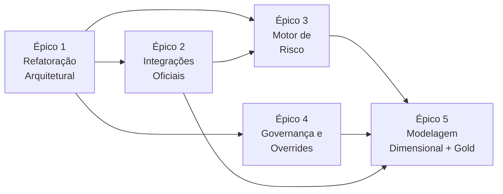

# Backlog de Atividades — BD Crédito
### Análise Arquitetural e Roadmap de Sprints

> **Documento de referência:** Planejamento do Sistema de Gestão de Dados de Crédito — BD Crédito v1.2 (21/07/2026)
> **Data desta análise:** 09/08/2026
> **Autor:** Arquiteto de Dados / Tech Lead

---

## 1. Diagnóstico do Estado Atual

### 1.1 O que já funciona

| Capacidade | Arquivo(s) | Status |
|---|---|---|
| Triagem e coleta de fichas na rede | [0_obter_e_triar.py](file:///c:/Users/malik/Downloads/BDC/BDC/0_obter_e_triar.py) | ✅ Operacional |
| Pipeline de ingestão de fichas de Comercializadoras | [fichas_comercializadoras_service.py](file:///c:/Users/malik/Downloads/BDC/BDC/src/services/fichas_comercializadoras_service.py) | ✅ Operacional |
| Pipeline de ingestão de fichas de Consumidores | [fichas_consumidores_service.py](file:///c:/Users/malik/Downloads/BDC/BDC/src/services/fichas_consumidores_service.py) | ✅ Operacional |
| Classificação de layout (7 versões Comercializadoras, 3 Consumidores) | [ficha_classifier.py](file:///c:/Users/malik/Downloads/BDC/BDC/src/services/ficha_classifier.py) + 12 JSONs de layout | ✅ Operacional |
| Extração de campos do Excel | [ficha_extractor.py](file:///c:/Users/malik/Downloads/BDC/BDC/src/services/ficha_extractor.py) | ✅ Operacional |
| Normalização de tipos de campo | [field_type_normalizer.py](file:///c:/Users/malik/Downloads/BDC/BDC/src/silver/field_type_normalizer.py) | ✅ Operacional |
| Validação técnica de campos | [ficha_validator.py](file:///c:/Users/malik/Downloads/BDC/BDC/src/services/ficha_validator.py) | ✅ Parcial (básico) |
| Dedup por hash e chave de negócio | [dedup_service.py](file:///c:/Users/malik/Downloads/BDC/BDC/src/services/dedup_service.py) | ✅ Operacional |
| Motor de PD (CPURA, CGRUPO, CONSUMIDOR_GT_5) | [pd_engine.py](file:///c:/Users/malik/Downloads/BDC/BDC/src/domain/credito/pd_engine.py) + 8 módulos | ✅ Operacional |
| Segmentação metodológica | [segmentacao.py](file:///c:/Users/malik/Downloads/BDC/BDC/src/domain/contrapartes/segmentacao.py) | ⚠️ Parcial (falta CONSUMIDOR_LE_5) |
| Camadas Staging → Bronze → Silver | [staging/](file:///c:/Users/malik/Downloads/BDC/BDC/src/staging), [storage/](file:///c:/Users/malik/Downloads/BDC/BDC/src/storage) | ✅ Operacional |

### 1.2 O que está completamente ausente

| Gap | Seção do PDF | Impacto |
|---|---|---|
| Conector Denodo (contratos e volume para enquadramento ≥ 5 MWm) | §3.4, §6.2 | 🔴 Crítico — bloqueia segmentação real de consumidores |
| Conector MtM (exposição de risco) | §3.5, §6.7 | 🔴 Crítico — sem EAD, não há cálculo de PE |
| Conector Salesforce (Account, Cotação, Chamado, Contrato) | §3.3 | 🟠 Alto — sem reconciliação de rating e grupo econômico |
| Conector Receita Federal (situação cadastral, CNAE) | §3.6 | 🟡 Médio — sem validação cadastral externa |
| Motor EAD (Exposure at Default) | §6.7, §7.1 | 🔴 Crítico |
| Motor LGD (Loss Given Default com garantias) | §6.8, §7.1 | 🔴 Crítico |
| Motor PE = EAD × LGD × PD | §6.7, §7.1, §7.3 | 🔴 Crítico |
| Motor Taxa de Risco | §7.1, §11.6 | 🔴 Crítico |
| Cadastro de Garantias | §2 ("Garantias"), §6.8 | 🔴 Crítico |
| Módulo de Carga Manual Controlada | §1.5, §4.3, §5.3, §14 | 🟠 Alto |
| Módulo de Overrides com auditoria | §11.7, §11.7.1 | 🟠 Alto |
| Tabelas Dimensionais (dim_contraparte, dim_analise, etc.) | §8.1, §8.2 | 🟠 Alto |
| Tabelas de Fato (fato_analise_credito, fato_exposicao, etc.) | §8.2 | 🟠 Alto |
| Camada Gold — Visão consolidada por contraparte | §7.1 | 🟠 Alto |
| Arquivo Excel padronizado para cálculo de limites | §7.3 | 🔴 Crítico |
| Tabelas de auditoria (ctl_*) | §11.5 | 🟡 Médio |
| Reconciliações obrigatórias (13 tipos) | §11.6 | 🟡 Médio |
| Alertas de negócio (25+ tipos) | §6.10, Apêndice B | 🟡 Médio |
| Segmento CONSUMIDOR_LE_5 (bureau) | §3.2, §6.2 | 🟠 Alto |
| Matriz de transição de rating | §7.2 | 🟡 Médio |

---

## 2. Análise de Dívida Técnica: O "Inferno de JSONs"

### 2.1 Números do problema

| Métrica | Valor |
|---|---|
| **Total de arquivos JSON de controle** | **31 arquivos** |
| **Tamanho total** | **~170 KB** |
| **Subdiretórios de controle** | 6 (`configs/`, `layouts/`, `mappings/`, `quality/`, `rules/`, `schemas/`) |
| **Maior arquivo** | `mapping_fichas_comercializadoras.json` — **37 KB** |

### 2.2 Problemas estruturais identificados

1. **Duplicação de regras de negócio:** Os JSONs de `quality/` definem `required_fields`, `date_fields`, `numeric_fields` — mas o [ficha_validator.py](file:///c:/Users/malik/Downloads/BDC/BDC/src/services/ficha_validator.py) re-implementa validações imperativas para PD, PL e datas em Python puro. As regras de domínio (ex: PD ∈ [0,1]) existem em dois lugares sem sincronia formal.

2. **Nenhuma validação de schema em runtime:** Os 7 schemas em `control/schemas/` (incluindo `schema_config.json` com ~8 KB) **nunca são carregados nem validados**. O [context.py](file:///c:/Users/malik/Downloads/BDC/BDC/src/app/context.py) lê `app_config.json` e `config.json` com `read_json()` sem nenhuma validação contra seus schemas declarados. Se alguém alterar uma chave no `app_config.json`, o erro aparece apenas em runtime como `KeyError`.

3. **Caminhos hardcoded no app_config.json:** O [app_config.json](file:///c:/Users/malik/Downloads/BDC/BDC/ENTRADAS/configs/app_config.json) contém **97 referências hardcoded** ao diretório `C:\Users\C807951\Desktop\BDC`. Não há resolução dinâmica por variável de ambiente. Portabilidade zero.

4. **Mappings monolíticos:** O `mapping_fichas_comercializadoras.json` (37 KB, ~600+ linhas) contém cada mapeamento célula-a-célula como objeto JSON. Alterações de layout exigem que o operador edite JSON manualmente com risco de quebra silenciosa.

5. **Regras de PD em JSON + Python:** As faixas de PD ([pd_faixas.json](file:///c:/Users/malik/Downloads/BDC/BDC/ENTRADAS/control/configs/pd_faixas.json)) e regras de transformação ([pd_transform_rules.json](file:///c:/Users/malik/Downloads/BDC/BDC/ENTRADAS/control/rules/pd_transform_rules.json)) são lidas e consumidas pelo [pd_transform.py](file:///c:/Users/malik/Downloads/BDC/BDC/src/domain/credito/pd_transform.py) — mas este módulo duplica validações de estrutura (`"min" not in faixa`) que deveriam ser feitas na carga, não na execução do cálculo.

---

## 3. Backlog Detalhado por Épico

---

## Épico 1: Refatoração Arquitetural e Eliminação de Dívida Técnica

> **Objetivo:** Substituir a dependência de 31 arquivos JSON estáticos não validados por uma camada de configuração dinâmica, validada e versionada em Python, consolidando a fonte da verdade e eliminando duplicação de regras.

### História 1.1 — Validação de Schema em Runtime

| Tarefa | Descrição | DoD (Critério de Aceite) | Esforço | Seção PDF |
|---|---|---|---|---|
| **T1.1.1** Implementar validação de `app_config.json` na inicialização | Integrar `jsonschema` (ou Pydantic) para validar `app_config.json` e `config.json` contra seus schemas declarados (`schema_app_config.json`, `schema_config.json`) no boot do `load_context()`. | O sistema **recusa iniciar** se qualquer campo obrigatório estiver ausente ou com tipo errado. Teste unitário cobre 5+ cenários de config inválida. | Médio | §1.5 (Parametrização), §5.1 (Padrões de dados) |
| **T1.1.2** Implementar validação de mappings e quality rules na carga | Os loaders em [mapping_loader.py](file:///c:/Users/malik/Downloads/BDC/BDC/src/control/mapping_loader.py) e [quality_loader.py](file:///c:/Users/malik/Downloads/BDC/BDC/src/control/quality_loader.py) devem validar estrutura contra schemas antes de retornar os dados. | Mapping malformado gera erro com mensagem descritiva antes do processamento de qualquer ficha. Teste com mapping corrompido presente. | Médio | §5.3 (Regras de validação) |
| **T1.1.3** Validar JSONs de layout na carga | O [layout_catalog.py](file:///c:/Users/malik/Downloads/BDC/BDC/src/control/layout_catalog.py) deve checar que cada layout possui `fields` com `label`, `cell`, e tipo coerente. | Layout com `cell` ausente é rejeitado na carga, não no meio da extração. | Baixo | §4.1 (Classificação documental) |

### História 1.2 — Resolução Dinâmica de Caminhos

| Tarefa | Descrição | DoD | Esforço | Seção PDF |
|---|---|---|---|---|
| **T1.2.1** Introduzir `base_dir` relativo + variável de ambiente | Reescrever `app_config.json` para usar caminhos relativos a `${BDC_BASE_DIR}` ou ao diretório do projeto. O [context.py](file:///c:/Users/malik/Downloads/BDC/BDC/src/app/context.py) resolve os caminhos dinamicamente. | O projeto executa em qualquer máquina que defina `BDC_BASE_DIR` ou use o diretório do projeto como fallback. Os 97 caminhos hardcoded são eliminados. | Médio | §9 (Arquitetura de dados, ambientes) |
| **T1.2.2** Criar `config_builder.py` que gera config validada | Classe que recebe `base_dir` e gera programaticamente o dicionário de caminhos, eliminando a necessidade de editar JSON manualmente. | `AppContext` pode ser construído sem arquivo JSON em testes. | Baixo | §1.5 (Parametrização), §12 (Operação) |

### História 1.3 — Consolidação das Regras de Qualidade

| Tarefa | Descrição | DoD | Esforço | Seção PDF |
|---|---|---|---|---|
| **T1.3.1** Migrar `field_types_*.json` para classes Python tipadas | Criar `FieldTypeConfig` (dataclass/Pydantic) em `src/control/field_types.py` que declare `date_fields`, `float_fields`, `text_fields`, `cnpj_fields` por tipo de ficha. Manter compatibilidade para leitura de JSON legado como fallback. | O [field_type_normalizer.py](file:///c:/Users/malik/Downloads/BDC/BDC/src/silver/field_type_normalizer.py) usa a classe diretamente. Campo adicionado sem editar JSON. Testes cobrem ambos os modos. | Médio | §5.2 (Dimensões de qualidade) |
| **T1.3.2** Unificar regras de validação de domínio | Extrair as validações de PD ∈ [0,100], PL numérico, datas plausíveis de [ficha_validator.py](file:///c:/Users/malik/Downloads/BDC/BDC/src/services/ficha_validator.py) para um `DomainRuleEngine` que aplique regras de `data_quality_rules_*.json` **e** validações de domínio em um único passo. | Nenhuma regra de domínio duplicada entre JSON e Python. Relatório de validação unificado. | Alto | §5.2, §5.3 (Regras de validação) |
| **T1.3.3** Implementar domínios controlados como Enums Python | Criar Enums para: `StatusAnalise`, `TipoAnalise`, `StatusDocumento`, `SeveridadeAlerta`, `SegmentoMetodologico`, etc., conforme Apêndice A do PDF. | Qualquer valor fora do domínio é rejeitado com mensagem clara. Domínios são importáveis por qualquer módulo. | Médio | Apêndice A (Domínios mínimos) |

### História 1.4 — Segmentação Completa (CONSUMIDOR_LE_5)

| Tarefa | Descrição | DoD | Esforço | Seção PDF |
|---|---|---|---|---|
| **T1.4.1** Implementar segmento `CONSUMIDOR_LE_5_BUREAU` no `segmentacao.py` | O [segmentacao.py](file:///c:/Users/malik/Downloads/BDC/BDC/src/domain/contrapartes/segmentacao.py) hoje retorna `CONSUMIDOR_GT_5` para todo consumidor. Implementar a bifurcação baseada em `volume_enquadramento_mwm >= 5`. | Consumidor com volume < 5 MWm retorna `CONSUMIDOR_LE_5`. Consumidor sem volume retorna `NAO_ENQUADRADO`. | Baixo | §3.2, §6.2 (Segmentação) |
| **T1.4.2** Criar módulo `pd_consumidor_le5.py` (análise por bureau) | Motor simplificado que calcula PD a partir de score de bureau + restritivos, sem demonstrações financeiras. | PD calculada corretamente para consumidores < 5 MWm usando faixas de `pd_faixas.json["CONSUMIDOR_LE_5"]`. Campos de DF marcados como `NAO_APLICAVEL`. | Médio | §3.2 (Consumidor abaixo de 5 MWm) |

---

## Épico 2: Integração com Fontes Oficiais (Gargalos de Negócio)

> **Objetivo:** Implementar conectores para Denodo (contratos/volume) e MtM (exposição), que são pré-requisitos bloqueantes para o enquadramento real de consumidores e para o cálculo de Perda Esperada.

### História 2.1 — Conector Denodo (Contratos e Volume)

| Tarefa | Descrição | DoD | Esforço | Seção PDF |
|---|---|---|---|---|
| **T2.1.1** Criar `src/services/denodo_connector.py` | Módulo que se conecta ao Denodo (JDBC/ODBC ou REST), executa query parametrizada por competência e retorna DataFrame com: CNPJ, contrato, competência, volume_mwm, vigência_inicio, vigência_fim, status. | Conector retorna dados de pelo menos 1 competência. Credenciais via `.env`. Tratamento de indisponibilidade com retry e fallback para snapshot anterior. | Alto | §3.4 (Relatório de contratos do Denodo) |
| **T2.1.2** Criar ingestão Bronze/Silver para contratos Denodo | Pipeline que persiste snapshot bruto na Bronze (`bronze/denodo_contratos_raw/`) e grava versão normalizada na Silver com chave (CNPJ, contrato, competência). | Dados versionados por data de extração. Snapshot preservado como evidência imutável. | Médio | §3.4, §9 (Camadas de dados) |
| **T2.1.3** Implementar cálculo de `volume_enquadramento_mwm` | Consumir dados da Silver de Denodo para calcular, por CNPJ, o maior volume mensal simultâneo contratado. Gravar no cadastro da contraparte. | Volume calculado e campo `possui_pelo_menos_5_mwm` populado automaticamente. Rastreabilidade de fonte, competência e regra de enquadramento. | Médio | §6.2 (Segmentação), §6.1 (Cadastro) |

### História 2.2 — Conector MtM (Exposição de Risco)

| Tarefa | Descrição | DoD | Esforço | Seção PDF |
|---|---|---|---|---|
| **T2.2.1** Criar `src/services/mtm_connector.py` | Módulo que lê a base de MtM consolidada (formato definido pela área de risco de mercado). Retorna DataFrame com: CNPJ, contrato, data_base, mtm_positivo, mtm_negativo, notional. | Conector lê pelo menos 1 arquivo/tabela de MtM. Tratamento de formato e encoding. | Alto | §3.5 (MtM) |
| **T2.2.2** Criar ingestão Bronze/Silver para MtM | Snapshot bruto na Bronze. Silver com agregação por contraparte + data_base: `mtm_positivo_total`, `mtm_negativo_total`, `notional_total`. | Soma por contraparte e data-base reconciliável com a fonte original dentro de tolerância parametrizada. | Médio | §3.5, §11.6 (Reconciliação MtM) |
| **T2.2.3** Implementar reconciliação Denodo × MtM | Comparar contratos do Denodo com posições do MtM. Classificar cada par como: `CONCILIADO`, `CONTRATO_SEM_MTM`, `MTM_SEM_CONTRATO`, `DIVERGENTE`. | Relatório de reconciliação gerado. Alertas `CTR_001` e `CTR_002` disparados automaticamente. Status de conciliação gravado no cadastro da contraparte. | Alto | §5.4, §11.6 (Reconciliação Denodo × MtM) |

### História 2.3 — Conector Salesforce (Cadastro e Rating)

| Tarefa | Descrição | DoD | Esforço | Seção PDF |
|---|---|---|---|---|
| **T2.3.1** Criar `src/services/salesforce_connector.py` | Conector via API REST do Salesforce (simple-salesforce ou httpx). Consulta objetos: Account, Cotação, Chamado, Contrato. | Retorna DataFrames por objeto com campos conforme §3.3. Autenticação via OAuth/.env. | Alto | §3.3 (Salesforce) |
| **T2.3.2** Ingestão e reconciliação Salesforce | Bronze snapshot + Silver normalizada. Reconciliação de CNPJ, grupo econômico e rating entre ficha e Salesforce. | Divergências geram alertas `CAD_002`. Rating concorrente por fonte armazenado. | Alto | §5.4 (Regras de matching) |

### História 2.4 — Conector Receita Federal

| Tarefa | Descrição | DoD | Esforço | Seção PDF |
|---|---|---|---|---|
| **T2.4.1** Criar `src/services/receita_connector.py` | Consulta API de CNPJ (ReceitaWS, BrasilAPI ou endpoint interno). Retorna: situação cadastral, data abertura, CNAE principal, natureza jurídica. | Consulta individual por CNPJ com rate limiting. Cache local para evitar consultas repetidas no mesmo dia. | Médio | §3.6 (Receita/Gov.br) |
| **T2.4.2** Validação cadastral e alertas | Comparar situação cadastral com o domínio esperado. CNPJ irregular gera alerta `CAD_001`. | Alerta gerado automaticamente. Histórico de consultas preservado. | Baixo | §6.10 (Alertas de negócio) |

---

## Épico 3: Finalização do Motor de Risco de Crédito

> **Objetivo:** Implementar os módulos de cálculo de EAD, LGD, Perda Esperada (PE) e Taxa de Risco, completando a cadeia PD → EAD → LGD → PE → Taxa de Risco exigida pelo planejamento.

### História 3.1 — Cadastro de Garantias

| Tarefa | Descrição | DoD | Esforço | Seção PDF |
|---|---|---|---|---|
| **T3.1.1** Criar modelo de dados de garantias | Definir schema para: garantia_id, contraparte_id, tipo_garantia, valor_nominal, valor_atualizado, valor_elegivel, emissor, vigencia_inicio, vigencia_fim, status, cobertura. | Schema definido e documentado. Enum `StatusGarantia` implementado. | Médio | §2 (Módulo Garantias), §7.2 |
| **T3.1.2** Criar `src/services/garantias_service.py` | Serviço de ingestão de garantias (arquivo Excel/CSV de entrada). Validação de vigência, elegibilidade e alocação. | Garantias ingeridas, versionadas, nunca sobrescritas. Alertas `GAR_001` (vencida) e `GAR_002` (cobertura insuficiente) disparados. | Alto | §6.8, Apêndice B |

### História 3.2 — Motor de EAD (Exposure at Default)

| Tarefa | Descrição | DoD | Esforço | Seção PDF |
|---|---|---|---|---|
| **T3.2.1** Criar `src/domain/credito/ead_engine.py` | Calcular EAD por contraparte a partir do MtM positivo consolidado. Fórmula: EAD = MtM positivo × fator de conversão parametrizado. | EAD calculado para todas as contrapartes com posição MtM. Resultado versionado com `calculo_id` e `config_snapshot_id`. | Médio | §6.7 (Exposição), §7.1 |
| **T3.2.2** Vincular EAD ao cadastro da contraparte | Gravar EAD calculado na visão atualizada da contraparte com data-base e rastreabilidade. | Campo `EAD` populado na visão consolidada. Alerta `EXP_001` disparado se EAD > 0 sem análise vigente. | Baixo | §7.1, §6.10 |

### História 3.3 — Motor de LGD (Loss Given Default)

| Tarefa | Descrição | DoD | Esforço | Seção PDF |
|---|---|---|---|---|
| **T3.3.1** Criar `src/domain/credito/lgd_engine.py` | Calcular LGD bruta (parametrizada por segmento) e LGD líquida (após desconto de garantias elegíveis). `LGD_liquida = LGD_bruta × (1 - cobertura_garantias)`. | LGD calculada com e sem garantias. Parâmetro de LGD bruta por segmento em config. Resultado rastreável. | Médio | §6.8, §7.1, Apêndice C |

### História 3.4 — Motor de Perda Esperada (PE) e Taxa de Risco

| Tarefa | Descrição | DoD | Esforço | Seção PDF |
|---|---|---|---|---|
| **T3.4.1** Criar `src/domain/credito/pe_engine.py` | Calcular PE = EAD × LGD × PD por contraparte, competência e horizonte. | PE calculada em R$ e percentual. Reconciliação: recalcular amostras e verificar PE = EAD × LGD × PD dentro de tolerância. | Médio | §6.7, §11.6 (Reconciliação PE) |
| **T3.4.2** Criar cálculo de Taxa de Risco de Crédito | `Taxa_Risco = PE_total / Notional_total` por competência e horizonte. | Taxa calculada e coerente: mesma competência/horizonte entre PE e notional. Resultado versionado. | Baixo | §7.1, §11.6 (Reconciliação taxa de risco) |
| **T3.4.3** Integrar motores (EAD → LGD → PE → Taxa) no pipeline | Orquestrar os cálculos em sequência no serviço principal. Garantir que cada cálculo gera `calculo_id` único. | Pipeline completo roda ponta a ponta. Um único `run_id` rastreia todos os cálculos derivados. | Alto | §11.2 (Identificadores), §14 |

---

## Épico 4: Módulo de Governança e Overrides (Carga Manual)

> **Objetivo:** Implementar o fluxo de Carga Manual Controlada e Overrides exigido no PDF, preservando trilha de auditoria completa, distinção entre data do fato e data de registro, e dupla aprovação.

### História 4.1 — Estrutura de Carga Manual

| Tarefa | Descrição | DoD | Esforço | Seção PDF |
|---|---|---|---|---|
| **T4.1.1** Definir template/formulário de carga manual | Criar schema do template Excel/CSV com campos obrigatórios: CNPJ, competência, campo, valor, motivo, evidência, solicitante, tipo_evento_manual. | Template documentado e validável. Campos conforme Apêndice A (`tipo_evento_manual`, `status_aprovacao_manual`). | Baixo | §4.3, §11.7.1 |
| **T4.1.2** Criar `src/domain/carga_manual/carga_manual_service.py` | Serviço que: (a) valida template, (b) registra como novo evento versionado, (c) nunca sobrescreve registro anterior, (d) grava dupla temporalidade (data_fato + data_registro). | Carga manual rejeitada se: sem CNPJ válido, sem motivo, sem evidência, ou campo não permitido. Status inicial = `PENDENTE`. | Alto | §4.3, §5.3 (Regra: impedir sobrescrita), §14 |
| **T4.1.3** Criar fluxo de aprovação | Registro manual só compõe a visão oficial após aprovação (status = `APROVADO`). Aprovador ≠ Solicitante. Prazo de expiração parametrizado. | Tabela `ctl_aprovacao_manual` populada. Campo publicado bloqueado se pendente ou sem evidência. | Alto | §11.7, §14.8 |

### História 4.2 — Overrides de Resultados Calculados

| Tarefa | Descrição | DoD | Esforço | Seção PDF |
|---|---|---|---|---|
| **T4.2.1** Criar `src/domain/carga_manual/override_service.py` | Override altera resultado calculado (rating, PD, classe). Requisitos: justificativa, evidência, alçada (solicitante ≠ aprovador), vigência com data de expiração, valores antes/depois. | Tabela `ctl_override` populada. Relatórios indicam que o valor possui override vigente. Override expirado gera alerta `EXC_001`. | Alto | §11.7 (Overrides), §14.8 |
| **T4.2.2** Tratar ausência de DF como caso especial | Quando a contraparte não envia DF: registro de `situacao_df = NAO_RECEBIDA` + `motivo_ausencia_df`. Manutenção de rating/PD exige override aprovado com prazo. | Registro manual de ausência de DF **não satisfaz** exigência de análise detalhada. Override necessário com vigência. Alerta `DF_001` disparado. | Médio | §4.3, §5.3, §14.8 |

### História 4.3 — Recálculo Impactado por Atualização Manual

| Tarefa | Descrição | DoD | Esforço | Seção PDF |
|---|---|---|---|---|
| **T4.3.1** Identificar e recalcular resultados impactados | Quando carga manual ou override é aprovado, identificar cálculos dependentes (PD, EAD, LGD, PE, Taxa) e recalcular apenas os impactados. Nova versão gerada; publicação anterior preservada. | Recálculo gera novo `calculo_id`. Alerta `MAN_004` disparado. Justificativa do reprocessamento registrada. | Alto | §5.3, §11.4 |

---

## Épico 5: Modelagem Dimensional e Camada Gold

> **Objetivo:** Migrar os dados da Silver para as tabelas Fato/Dimensão do modelo relacional (hoje os diretórios `SAIDAS/relational/` existem mas estão **completamente vazios**) e gerar o exportador final para o sistema de limites e Power BI.

### História 5.1 — Tabelas Dimensionais

| Tarefa | Descrição | DoD | Esforço | Seção PDF |
|---|---|---|---|---|
| **T5.1.1** Criar `dim_contraparte` | Uma linha por contraparte lógica: contraparte_id, CNPJ, CNPJ_raiz, nome, tipo, grupo_economico, controladora, situação_cadastral, setor, segmento_metodologico. | Arquivo Parquet/CSV gerado em `SAIDAS/relational/dimensions/`. Chave surrogate `contraparte_id` única. SCD Type 2 para mudanças de grupo/segmento. | Alto | §8.1 |
| **T5.1.2** Criar `dim_analise` | Uma linha por análise: analise_id, data, tipo, status, versão, responsável, validade. | Análises históricas preservadas. Nenhum registro anterior removido. | Médio | §8.1 |
| **T5.1.3** Criar `dim_garantia` | Uma linha por garantia: garantia_id, tipo, emissor, vigência, status, valor. | Dimensão populada a partir do cadastro de garantias. | Médio | §8.1, §7.2 |
| **T5.1.4** Criar demais dimensões de suporte | `dim_data` (calendário), `dim_contrato`, `dim_rating_escala` (domínio de ratings com PD de referência e vigência). | Dimensões de suporte populadas. Rating pertence ao domínio controlado. | Médio | §8.1, §5.1 |

### História 5.2 — Tabelas de Fato

| Tarefa | Descrição | DoD | Esforço | Seção PDF |
|---|---|---|---|---|
| **T5.2.1** Criar `fato_analise_credito` | Grão: (contraparte_id, analise_id, data_analise). Métricas: rating, PD, scores, classe, modelo, data_DF. | Uma linha por análise e versão. Histórico completo preservado. | Alto | §8.2 |
| **T5.2.2** Criar `fato_exposicao_risco` | Grão: (contraparte_id, data_base, competência). Métricas: MtM_positivo, EAD, LGD, PE, taxa_risco. | Fato populado após pipeline de risco completo. Reconciliável com Silver. | Alto | §8.2 |
| **T5.2.3** Criar `fato_alerta` | Uma linha por alerta: código, severidade, campo_afetado, valor_observado, limite_esperado, status, responsável. | Alertas rastreáveis. Código pertence ao domínio do Apêndice B. | Médio | §6.10, §8.2 |

### História 5.3 — Visão Consolidada (Gold) e Arquivo de Limites

| Tarefa | Descrição | DoD | Esforço | Seção PDF |
|---|---|---|---|---|
| **T5.3.1** Criar visão consolidada atual por contraparte | Uma linha por contraparte com: cadastro, análise, risco (rating, PD, EAD, LGD, PE, taxa), garantias, alertas, auditoria, contrato, segmentação, conciliação, situação_df, dado_manual. | Campos conforme Apêndice C. Visão publicada com timestamp, versão de layout e hash. Ponteiro `latest` sem sobrescrever histórico. | Alto | §7.1, Apêndice C |
| **T5.3.2** Criar exportador de arquivo Excel para cálculo de limites | Gerar arquivo Excel padronizado com campos mínimos: nome, CNPJ, tipo, PL, PL_ajustado, rating, data_DF, contraparte_id, analise_id, possui_contrato_copel, volume, segmento, situacao_df, origem_analise, validade_excecao. | Arquivo gerado com metadados (run_id, versão_layout, data_geração). Somente publicado após controles críticos aprovados. Versionado (nunca sobrescrito). | Alto | §7.3 (Arquivo de entrada para cálculo de limites) |
| **T5.3.3** Criar interface para consumo pelo Power BI | Power BI deve consumir a camada relacional (dimensions + facts), não arquivos-fonte. Documentar modelo semântico e relacionamentos. | Modelo relacional documentado e consumível. Power BI conecta via Parquet/CSV da camada relacional. | Médio | §7.4 (Power BI deve consumir camada relacional) |

### História 5.4 — Tabelas de Auditoria e Controle

| Tarefa | Descrição | DoD | Esforço | Seção PDF |
|---|---|---|---|---|
| **T5.4.1** Criar tabelas `ctl_run_pipeline` e `ctl_documento` | Registrar cada execução (run_id, ambiente, início/fim, status, totais) e cada documento processado (hashes, caminhos, status). | Toda execução rastreável. Reconciliação de arquivos: descobertos = processados + pendentes + rejeitados. | Médio | §11.5, §11.6 |
| **T5.4.2** Criar tabela `ctl_campo_origem` (linhagem de campo) | Para campos extraídos de fichas: documento_id, aba, célula, rótulo, valor_bruto, valor_padronizado, transformação, confiança, versão_extrator. | Trilha de auditoria campo-a-campo navegável do Gold até a célula de origem. | Alto | §11.3 (Linhagem no nível do campo) |
| **T5.4.3** Criar tabelas `ctl_validacao_qualidade` e `ctl_regra_aplicada` | Registrar cada regra de qualidade aplicada (severidade, resultado, tolerância) e cada regra de negócio (regra_id, versão, entradas, parâmetros, saída). | Nenhuma regra aplicada sem registro. Cálculos reproduzíveis a partir do snapshot. | Alto | §11.5 |
| **T5.4.4** Criar tabelas `ctl_reconciliacao` e `ctl_publicacao` | Registrar reconciliações (13 tipos conforme §11.6) e publicações (publicacao_id, arquivos, hashes, linhas, data, aprovador). | Publicação Gold bloqueada se reconciliações críticas falham acima da tolerância. | Médio | §11.6 (Reconciliações obrigatórias) |

---

## 4. Matriz de Dependências entre Épicos

> [!IMPORTANT]
> **Épico 1 é pré-requisito de todos os demais.** A base de configuração atual (caminhos hardcoded, sem validação de schema, sem domínios tipados) torna arriscado construir módulos novos sobre ela. A refatoração deve vir primeiro para evitar retrabalho.

> [!WARNING]
> **Épico 3 (Motor de Risco) depende do Épico 2 (Integrações).** Sem os dados do MtM, é impossível calcular EAD. Sem os dados do Denodo, é impossível segmentar consumidores corretamente. As Histórias 2.1 e 2.2 são pré-requisitos bloqueantes.

---

## 5. Resumo Quantitativo

| Métrica | Valor |
|---|---|
| **Épicos** | 5 |
| **Histórias** | 17 |
| **Tarefas** | 35 |
| **Tarefas Esforço Baixo** | 7 |
| **Tarefas Esforço Médio** | 16 |
| **Tarefas Esforço Alto** | 12 |
| **Módulos Python novos estimados** | ~15 |
| **Seções do PDF cobertas** | §1–§14 + Apêndices A, B, C |
| **% do escopo do PDF implementado (estimativa)** | **~25-30%** (Ingestão + PD) |
| **% do escopo do PDF restante** | **~70-75%** |

---

## 6. Recomendação de Sequência de Sprints

| Sprint | Épico | Histórias | Foco |
|---|---|---|---|
| Sprint 1-2 | Épico 1 | 1.1, 1.2, 1.3, 1.4 | Fundação sólida: validação, caminhos dinâmicos, domínios, segmentação completa |
| Sprint 3-4 | Épico 2 | 2.1, 2.2 | Conectores Denodo e MtM — desbloqueiam o Motor de Risco |
| Sprint 5 | Épico 2 | 2.3, 2.4 | Salesforce e Receita — reconciliação e validação cadastral |
| Sprint 6-7 | Épico 3 | 3.1, 3.2, 3.3, 3.4 | Garantias, EAD, LGD, PE, Taxa de Risco |
| Sprint 8 | Épico 4 | 4.1, 4.2, 4.3 | Carga manual controlada, overrides, recálculo |
| Sprint 9-10 | Épico 5 | 5.1, 5.2, 5.3, 5.4 | Modelo dimensional, Gold, arquivo de limites, auditoria |
