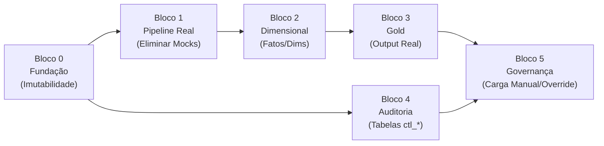

# FASE 2 — PLANO DE CORREÇÃO PRIORIZADO
## BD Crédito (BDC) — Correções por Severidade e Dependência

**Data:** 13/08/2026  
**Base:** Auditoria Fase 1 aprovada (92 requisitos, 31,5% correto)  
**Estratégia:** Correções incrementais, uma de cada vez, com validação após cada uma.

---

## PRINCÍPIO DE ORDENAÇÃO

As correções estão organizadas em **6 blocos sequenciais**, onde cada bloco desbloqueia o seguinte:



> [!IMPORTANT]
> **Bloco 0 é pré-requisito absoluto.** Sem corrigir a imutabilidade, qualquer dado novo gerado pelos blocos seguintes continuaria sendo sobrescrito.

---

## BLOCO 0 — FUNDAÇÃO: CORRIGIR IMUTABILIDADE (5 violações)

> **Impacto:** Corrige os 5 pontos de violação de §1.5/§11.10 confirmados na Fase 1.
> **Risco de schema:** SIM — muda comportamento de `silver_store.py` e `dedup_service.py`.

> [!WARNING]
> **Pergunta antes de implementar:** A correção do `merge_silver_dataset_by_business_key` mudará o comportamento de persistência das fichas de comercializadoras e consumidores. Em vez de sobrescrever o registro anterior com `keep="last"`, o sistema passará a **preservar todas as versões** com uma coluna de controle (`_VERSAO_REGISTRO`). Isso aumentará o tamanho dos arquivos Silver. **Aprovar?**

### C0.1 — `silver_store.py`: Eliminar sobrescrita em `merge_silver_dataset_by_business_key`

**Arquivo:** [silver_store.py](file:///c:/Users/malik/Downloads/BDC_v06/BDC/src/storage/silver_store.py)  
**Linhas:** 68-105  
**Mudança:**
- Remover `drop_duplicates(subset=business_keys, keep="last")`
- Substituir por lógica de versionamento: adicionar coluna `_VERSAO_REGISTRO` (incremento por business_key) e `_DT_CARGA` (timestamp da inserção)
- O concat preserva TODAS as linhas; a visão "atual" é obtida via filtro `_VERSAO_REGISTRO == max` em consultas downstream

```diff
- df_combined = df_combined.drop_duplicates(subset=business_keys, keep="last")
+ df_combined["_DT_CARGA"] = pd.Timestamp.now()
+ df_combined["_VERSAO_REGISTRO"] = (
+     df_combined.groupby(business_keys).cumcount() + 1
+ )
```

### C0.2 — `dedup_service.py`: Eliminar remoção em modo reprocess

**Arquivo:** [dedup_service.py](file:///c:/Users/malik/Downloads/BDC_v06/BDC/src/services/dedup_service.py)  
**Linhas:** 46-66  
**Mudança:**
- Remover o `history[:] = [item for item in history if not ...]` que apaga entradas
- Em modo reprocess, **marcar** o registro anterior como `status_extracao = "SUBSTITUIDO"` em vez de removê-lo
- Sempre fazer `history.append(manifest_record)` sem filtrar

```diff
  if load_mode == "reprocess" and cnpj and data_df:
-     history[:] = [
-         item for item in history
-         if not (item.get("status_extracao") == "SUCESSO"
-                 and item.get("cnpj_extraido") == cnpj
-                 and item.get("data_demonstracao_financeira") == data_df)
-     ]
+     for item in history:
+         if (item.get("status_extracao") == "SUCESSO"
+                 and item.get("cnpj_extraido") == cnpj
+                 and item.get("data_demonstracao_financeira") == data_df):
+             item["status_extracao"] = "SUBSTITUIDO"
+             item["dt_substituicao"] = datetime.now().isoformat()
  history.append(manifest_record)
```

### C0.3 — `camada_gold_service.py`: Versionar LATEST

**Arquivo:** [camada_gold_service.py](file:///c:/Users/malik/Downloads/BDC_v06/BDC/src/services/camada_gold_service.py)  
**Linhas:** 95-96  
**Mudança:**
- Antes de sobrescrever, **copiar** o LATEST existente para um arquivo versionado
- Manter o LATEST como ponteiro, mas preservar histórico

```diff
+ # Preserva versão anterior antes de sobrescrever
+ latest_parquet = gold_dir / "Limites_Credito_LATEST.parquet"
+ if latest_parquet.exists():
+     import shutil
+     ts = datetime.now().strftime("%Y%m%d_%H%M%S")
+     shutil.copy2(latest_parquet, gold_dir / f"Limites_Credito_HIST_{ts}.parquet")
  df_export.to_parquet(gold_dir / "Limites_Credito_LATEST.parquet", index=False)
```

### C0.4 — `mtm_ingestion_service.py`: Versionar filename Silver

**Arquivo:** [mtm_ingestion_service.py](file:///c:/Users/malik/Downloads/BDC_v06/BDC/src/services/mtm_ingestion_service.py)  
**Linha:** 108  
**Mudança:** Incluir `run_id` no filename para não sobrescrever.

```diff
- filename="mtm_agregado_contraparte"
+ filename=f"mtm_agregado_contraparte_{run_id}"
```

> [!WARNING]
> **Impacto downstream:** O `preparar_e_rodar_risco` em `main.py:45` lê `mtm_agregado_contraparte.parquet` com nome fixo. Precisará ser adaptado para buscar o mais recente via glob. **Aprovar?**

### C0.5 — `receita_ingestion_service.py`: Versionar filename Silver

**Arquivo:** [receita_ingestion_service.py](file:///c:/Users/malik/Downloads/BDC_v06/BDC/src/services/receita_ingestion_service.py)  
**Linha:** 111  
**Mudança:** Incluir `run_id` no filename.

```diff
- filename="receita_cadastral_silver"
+ filename=f"receita_cadastral_silver_{run_id}"
```

### C0.6 — `pipeline_risco_service.py`: Persistir `config_snapshot_id`

**Arquivo:** [pipeline_risco_service.py](file:///c:/Users/malik/Downloads/BDC_v06/BDC/src/services/pipeline_risco_service.py)  
**Linhas:** 87-98  
**Mudança:** Adicionar os campos de rastreabilidade que os engines já geram mas que são descartados.

```diff
  fato = {
      "RUN_ID": run_id,
      "CNPJ": cnpj,
      "DT_CALCULO": res_pe.get("dt_calculo"),
      "CALCULO_ID_EAD": res_ead.get("calculo_id"),
      "EAD_VALOR": res_ead.get("ead_valor"),
+     "CONFIG_SNAPSHOT_EAD": res_ead.get("config_snapshot_id"),
+     "FATOR_CONVERSAO_EAD": res_ead.get("fator_conversao"),
      "CALCULO_ID_LGD": res_lgd.get("calculo_id"),
      "LGD_LIQUIDA": res_lgd.get("lgd_liquida"),
+     "LGD_BRUTA": res_lgd.get("lgd_bruta"),
+     "CONFIG_SNAPSHOT_LGD": res_lgd.get("config_snapshot_id"),
+     "COBERTURA_GARANTIAS": res_lgd.get("cobertura_garantias"),
      "CALCULO_ID_PE": res_pe.get("calculo_id"),
      "PE_REAIS": res_pe.get("pe_reais"),
      "PE_PERCENTUAL": res_pe.get("pe_percentual"),
+     "PD_UTILIZADA": pd_final,
+     "SEGMENTO": segmento,
  }
```

---

## BLOCO 1 — PIPELINE REAL: ELIMINAR MOCKS DO `main.py`

> **Impacto:** Corrige o gap #1 (PD/segmento hardcoded). Conecta o motor de risco aos dados reais das fichas.
> **Dependência:** Bloco 0 (imutabilidade corrigida antes de gerar dados novos).

### C1.1 — `main.py`: Reescrever `preparar_e_rodar_risco`

**Arquivo:** [main.py](file:///c:/Users/malik/Downloads/BDC_v06/BDC/main.py)  
**Linhas:** 43-57  
**Mudança:** Em vez de copiar df_mtm e hardcodar PD=0.05 e SEGMENTO=CGRUPO, fazer o cruzamento real:
1. Ler fichas Silver (comercializadoras + consumidores) para obter PD_FINAL e SEGMENTO por CNPJ
2. Ler MtM Silver para obter MTM_POSITIVO_TOTAL e NOTIONAL_TOTAL por CNPJ
3. Fazer merge por CNPJ
4. Passar o DataFrame resultante para `run_pipeline_risco`

```python
def preparar_e_rodar_risco(context):
    """Cruza fichas (PD/Segmento) com MtM (Exposição) e roda o Motor de Risco."""
    # 1. Busca MtM mais recente
    mtm_dir = context.path("silver") / "mtm_consolidado_silver"
    mtm_files = sorted(mtm_dir.glob("mtm_agregado_contraparte*.parquet"), 
                       key=lambda f: f.stat().st_mtime, reverse=True)
    df_mtm = pd.read_parquet(mtm_files[0]) if mtm_files else pd.DataFrame()
    
    if df_mtm.empty:
        print("[AVISO] Sem base de MtM para calcular Risco.")
        return
    
    # 2. Busca fichas extraídas (PD e Segmento reais)
    df_fichas = pd.DataFrame()
    for segmento_dir in ["fichas_comercializadoras_extraidas", "fichas_consumidores_extraidas"]:
        path = context.path("silver") / segmento_dir
        parquets = list(path.glob("*.parquet"))
        if parquets:
            df_seg = pd.read_parquet(max(parquets, key=lambda f: f.stat().st_mtime))
            df_fichas = pd.concat([df_fichas, df_seg], ignore_index=True)
    
    # 3. Merge MtM + Fichas por CNPJ
    df_mtm["CNPJ"] = df_mtm["CNPJ"].astype(str).str.zfill(14)
    df_exposicoes = df_mtm.copy()
    
    if not df_fichas.empty and "CNPJ" in df_fichas.columns:
        df_fichas["CNPJ"] = df_fichas["CNPJ"].astype(str).str.zfill(14)
        # Pega a análise mais recente por CNPJ
        if "DT_PROCESSAMENTO" in df_fichas.columns:
            df_fichas = df_fichas.sort_values("DT_PROCESSAMENTO").drop_duplicates("CNPJ", keep="last")
        
        cols_ficha = ["CNPJ"]
        if "PD_FINAL" in df_fichas.columns: cols_ficha.append("PD_FINAL")
        if "SEGMENTO_PD" in df_fichas.columns: cols_ficha.append("SEGMENTO_PD")
        
        df_exposicoes = pd.merge(df_exposicoes, df_fichas[cols_ficha], on="CNPJ", how="left")
        
        # Renomeia para o schema esperado pelo pipeline
        if "SEGMENTO_PD" in df_exposicoes.columns:
            df_exposicoes["SEGMENTO_METODOLOGICO"] = df_exposicoes["SEGMENTO_PD"]
    
    # 4. Fallback conservador para CNPJs sem ficha (preserva alerta, não inventa dado)
    if "PD_FINAL" not in df_exposicoes.columns:
        df_exposicoes["PD_FINAL"] = None
    if "SEGMENTO_METODOLOGICO" not in df_exposicoes.columns:
        df_exposicoes["SEGMENTO_METODOLOGICO"] = "NAO_ENQUADRADO"
    
    return run_pipeline_risco(context, df_exposicoes=df_exposicoes)
```

### C1.2 — `main.py`: Reescrever `preparar_fato_analise`

**Arquivo:** [main.py](file:///c:/Users/malik/Downloads/BDC_v06/BDC/main.py)  
**Linha:** 69-72  
**Mudança:** Ler fichas Silver reais e dim_contraparte real, em vez de passar DataFrames vazios.

```python
def preparar_fato_analise(context):
    """Lê as fichas extraídas e a dim_contraparte para popular a Tabela de Fatos."""
    df_fichas = pd.DataFrame()
    for segmento_dir in ["fichas_comercializadoras_extraidas", "fichas_consumidores_extraidas"]:
        path = context.path("silver") / segmento_dir
        parquets = list(path.glob("*.parquet"))
        if parquets:
            df_seg = pd.read_parquet(max(parquets, key=lambda f: f.stat().st_mtime))
            df_fichas = pd.concat([df_fichas, df_seg], ignore_index=True)
    
    dim_path = context.path("relational_dimensions") / "dim_contraparte.parquet"
    if not dim_path.exists():
        dim_path = context.path("saidas") / "relational" / "dimensions" / "dim_contraparte.parquet"
    
    df_dim = pd.read_parquet(dim_path) if dim_path.exists() else pd.DataFrame()
    
    return build_fato_analise_credito(context, df_silver_analises=df_fichas, df_dim_contraparte=df_dim)
```

---

## BLOCO 2 — DIMENSIONAL: POPULAR FATOS E DIMENSÕES REAIS

> **Dependência:** Bloco 1 (dados reais fluindo pelo pipeline).

### C2.1 — `dim_contraparte_service.py`: Integrar Salesforce para grupo econômico

**Arquivo:** [dim_contraparte_service.py](file:///c:/Users/malik/Downloads/BDC_v06/BDC/src/services/dim_contraparte_service.py)  
**Linhas:** 64-65  
**Mudança:**
- Receber `df_silver_salesforce` como parâmetro adicional
- Extrair `GRUPO_ECONOMICO` e `CONTROLADORA` da base Salesforce via merge por CNPJ
- Manter "INDEPENDENTE" apenas como fallback quando não há match

### C2.2 — `dim_contraparte_service.py`: Implementar SCD Type 2 real

**Linhas:** 69-71  
**Mudança:**
- Antes de inserir, verificar se o registro CNPJ já existe no Parquet atual
- Se existir e houver mudança em `SEGMENTO` ou `GRUPO_ECONOMICO`, fechar o registro anterior (`DATA_FIM = hoje - 1, ATIVO = False`) e inserir novo registro
- Se não houver mudança, não inserir duplicata

### C2.3 — Criar `dim_analise_service.py` [NOVO]

**Arquivo:** `src/services/dim_analise_service.py`  
**Schema:** analise_id, data_analise, tipo (FICHA/MANUAL/OVERRIDE), status, versao, responsavel, validade  
**Fonte:** Fichas Silver + carga_manual Silver + override Silver

### C2.4 — Criar `dim_garantia_service.py` [NOVO]

**Arquivo:** `src/services/dim_garantia_service.py`  
**Schema:** garantia_id, tipo, emissor, vigencia_inicio, vigencia_fim, status, valor_nominal, valor_elegivel  
**Fonte:** garantias Silver (`fato_garantia.parquet`)

---

## BLOCO 3 — GOLD: GERAR OUTPUT REAL + REGRAS DE BLOQUEIO

> **Dependência:** Bloco 2 (dimensões e fatos populados).

### C3.1 — `camada_gold_service.py`: Gerar Excel (não apenas CSV/Parquet)

**Mudança:** Adicionar export via `openpyxl` para gerar `.xlsx` conforme §7.3.

### C3.2 — `camada_gold_service.py`: Implementar regras de bloqueio (§14.8)

**Mudança:** Antes de publicar na Gold, verificar:
1. Nenhuma reconciliação crítica com status `FALHOU`
2. Nenhum consumidor ≥5MWm sem DF vigente
3. Nenhum override expirado sem substituição

```python
def _verificar_bloqueios(context, df_gold, logger) -> list[str]:
    """Retorna lista de motivos de bloqueio. Lista vazia = publicação liberada."""
    bloqueios = []
    
    # Regra 1: Consumidor ≥5MWm sem DF
    if "SEGMENTO_METODOLOGICO" in df_gold.columns and "DATA_BALANCO_USADO" in df_gold.columns:
        mask_gt5 = df_gold["SEGMENTO_METODOLOGICO"].isin(["CONSUMIDOR_GT_5"])
        mask_sem_df = df_gold["DATA_BALANCO_USADO"].isna() | (df_gold["DATA_BALANCO_USADO"] == "NAO_AVALIADO")
        violacoes = df_gold[mask_gt5 & mask_sem_df]
        if not violacoes.empty:
            bloqueios.append(f"BLOQ_001: {len(violacoes)} consumidores ≥5MWm sem DF vigente")
    
    # Regra 2: Reconciliação crítica pendente
    rec_dir = context.path("silver") / "reconciliacao_contratos_mtm"
    if not any(rec_dir.glob("*.parquet")):
        bloqueios.append("BLOQ_002: Reconciliação Denodo×MtM não executada")
    
    return bloqueios
```

### C3.3 — Gerar alertas e pendências na Gold

**Mudança:** Consolidar alertas de todos os serviços (GAR, CTR, CAD, QLT) em `SAIDAS/gold/alertas_credito/` e pendências em `SAIDAS/gold/pendencias/`.

---

## BLOCO 4 — AUDITORIA: CRIAR TABELAS ctl_*

> **Dependência:** Bloco 0 (imutabilidade), pode rodar em paralelo com Blocos 1-3.

### C4.1 — Criar `ctl_run_pipeline` [NOVO]

**Arquivo:** `src/services/audit/ctl_run_pipeline_service.py`  
**Schema:** run_id, ambiente, dt_inicio, dt_fim, status_geral, total_etapas, etapas_ok, etapas_falha, versao_sistema  
**Integração:** `main.py` registra início/fim de cada execução.

### C4.2 — Criar `ctl_documento` [NOVO]

**Arquivo:** `src/services/audit/ctl_documento_service.py`  
**Schema:** documento_id, run_id, arquivo_origem, hash_arquivo, tipo_ficha, status_classificacao, status_extracao, dt_processamento  
**Integração:** `fichas_comercializadoras_service.py` e `fichas_consumidores_service.py` já geram `documento_id` — basta persistir em tabela dedicada.

### C4.3 — Criar `ctl_campo_origem` (linhagem campo-a-campo) [NOVO]

**Arquivo:** `src/services/audit/ctl_campo_origem_service.py`  
**Schema:** documento_id, campo_destino, aba_origem, celula_origem, rotulo_origem, valor_bruto, valor_padronizado, transformacao_aplicada, confianca, versao_extrator  
**Integração:** `ficha_extractor.py` precisará retornar metadados de célula junto com o valor.

> [!WARNING]
> **Pergunta antes de implementar:** A linhagem campo-a-campo exige modificar o `ficha_extractor.py` para retornar não apenas o valor, mas também a célula de origem e o rótulo encontrado. Isso muda a interface de `extract_record()`. **Aprovar?**

### C4.4 — Criar `ctl_validacao_qualidade` e `ctl_regra_aplicada` [NOVO]

**Schema validação:** regra_id, documento_id, campo, resultado (OK/FALHA), valor_observado, limite_esperado, severidade, tolerancia  
**Schema regra:** regra_id, versao, tipo (PD/RATING/EAD/LGD), entradas_json, parametros_json, saida_json, dt_execucao

### C4.5 — Criar `ctl_reconciliacao` e `ctl_publicacao` [NOVO]

**Schema reconciliação:** rec_id, tipo (13 tipos de §11.6), run_id, status, diferenca_absoluta, tolerancia, dt_execucao  
**Schema publicação:** publicacao_id, arquivos_json, hashes_json, total_linhas, dt_publicacao, aprovador

---

## BLOCO 5 — GOVERNANÇA: CARGA MANUAL E OVERRIDE REAIS

> **Dependência:** Blocos 0 + 4 (imutabilidade + tabelas de auditoria).

### C5.1 — `carga_manual_service.py`: Implementar fluxo real

**Mudanças:**
1. Criar template Excel em `ENTRADAS/templates/template_carga_manual.xlsx`
2. Adicionar campo `STATUS_APROVACAO = "PENDENTE"` (não vai direto para processado)
3. Criar função `aprovar_carga_manual(evento_id, aprovador)` que valida `aprovador ≠ solicitante`
4. Só compor visão oficial quando `STATUS_APROVACAO = "APROVADO"`

### C5.2 — `override_service.py`: Eliminar auto-aprovação

**Arquivo:** [override_service.py](file:///c:/Users/malik/Downloads/BDC_v06/BDC/src/services/override_service.py)  
**Linha:** 58  
**Mudança:**
```diff
- registro["STATUS"] = StatusAprovacao.APROVADO.value
+ registro["STATUS"] = StatusAprovacao.PENDENTE.value
```
Criar função separada `aprovar_override(override_id, aprovador)`.

### C5.3 — `main.py`: Remover dados de teste hardcoded

**Linhas:** 99-100  
**Mudança:**
- Carga manual: ler de `ENTRADAS/carga_manual/` em vez de `registros=[]`
- Override: ler de `ENTRADAS/overrides/` em vez de solicitação hardcoded

### C5.4 — Implementar recálculo por impacto

**Arquivo:** `src/services/recalculo_impacto_service.py` [NOVO]  
**Lógica:** Quando carga manual ou override é aprovado, identificar campo alterado → determinar cálculos dependentes (PD → EAD → LGD → PE → Taxa) → recalcular apenas os impactados → gerar novo `calculo_id` → preservar versão anterior.

---

## RESUMO DE EXECUÇÃO

| Bloco | Correções | Arquivos modificados | Arquivos novos | Prioridade |
|---|---|---|---|---|
| **0 — Imutabilidade** | C0.1–C0.6 | 5 | 0 | 🔴 URGENTE |
| **1 — Pipeline Real** | C1.1–C1.2 | 1 (main.py) | 0 | 🔴 URGENTE |
| **2 — Dimensional** | C2.1–C2.4 | 1 | 2 | 🟠 ALTO |
| **3 — Gold** | C3.1–C3.3 | 1 | 0 | 🟠 ALTO |
| **4 — Auditoria** | C4.1–C4.5 | 2 (integração) | 5 | 🟠 ALTO |
| **5 — Governança** | C5.1–C5.4 | 3 | 2 | 🟡 MÉDIO |
| **TOTAL** | **22 correções** | **~10** | **~9** | — |

---

## PERGUNTAS PENDENTES ANTES DE INICIAR

> [!IMPORTANT]
> Preciso de resposta para estas 3 perguntas antes de implementar:

1. **C0.1 (Imutabilidade Silver):** Aprovar mudança do `merge_silver_dataset_by_business_key` para preservar todas as versões? Isso aumentará o tamanho dos Parquets de fichas.

2. **C0.4 (Versionamento MtM):** Aprovar mudança do filename fixo `mtm_agregado_contraparte` para `mtm_agregado_contraparte_{run_id}`? Exige adaptar leitura downstream.

3. **C4.3 (Linhagem campo-a-campo):** Aprovar mudança da interface de `extract_record()` no `ficha_extractor.py` para retornar metadados de célula?

---

## ORDEM PROPOSTA DE IMPLEMENTAÇÃO

Após aprovação, implementarei na seguinte sequência, **uma correção por vez com validação**:

1. C0.6 (persistir config_snapshot_id — menor risco, alto valor)
2. C0.3 (versionar LATEST — baixo risco)
3. C0.1 (imutabilidade Silver — médio risco, alto impacto)
4. C0.2 (dedup sem remoção — médio risco)
5. C0.4 + C0.5 (versionar filenames MtM e Receita)
6. C1.1 (eliminar mock do pipeline de risco — **ponto de inflexão**)
7. C1.2 (fato_analise com dados reais)
8. C2.1 + C2.2 (dim_contraparte real com SCD)
9. C3.2 (regras de bloqueio Gold)
10. C4.1 + C4.2 (ctl_run_pipeline + ctl_documento)
11. Restante por prioridade
